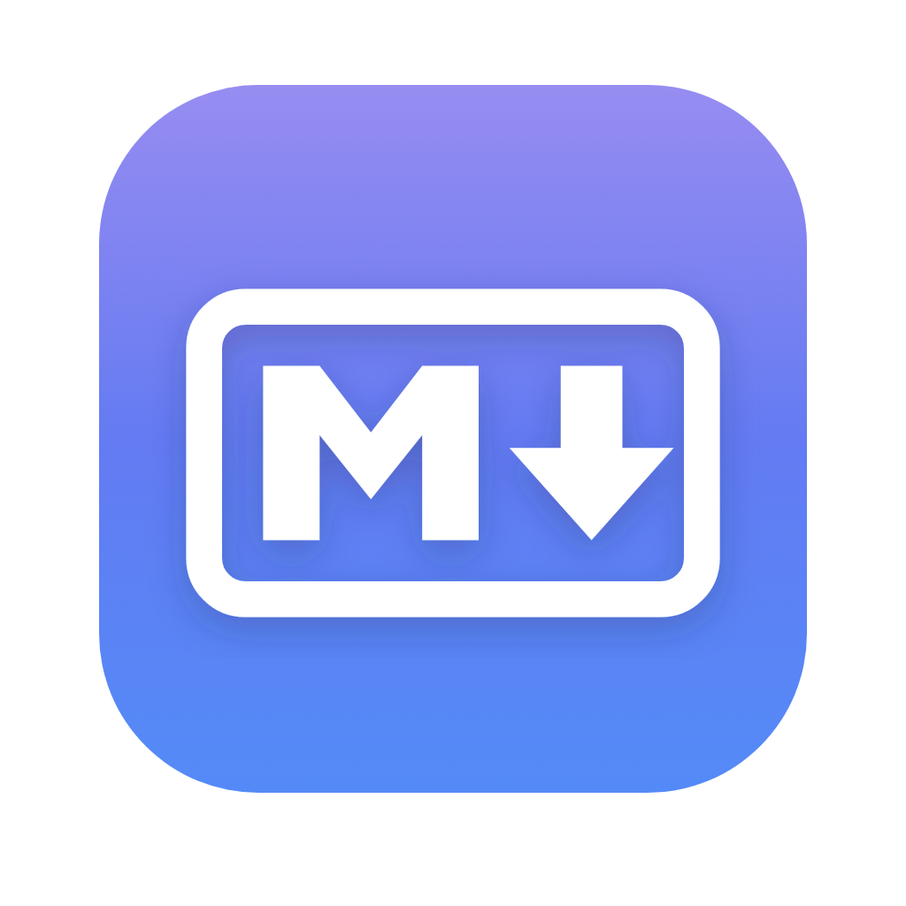
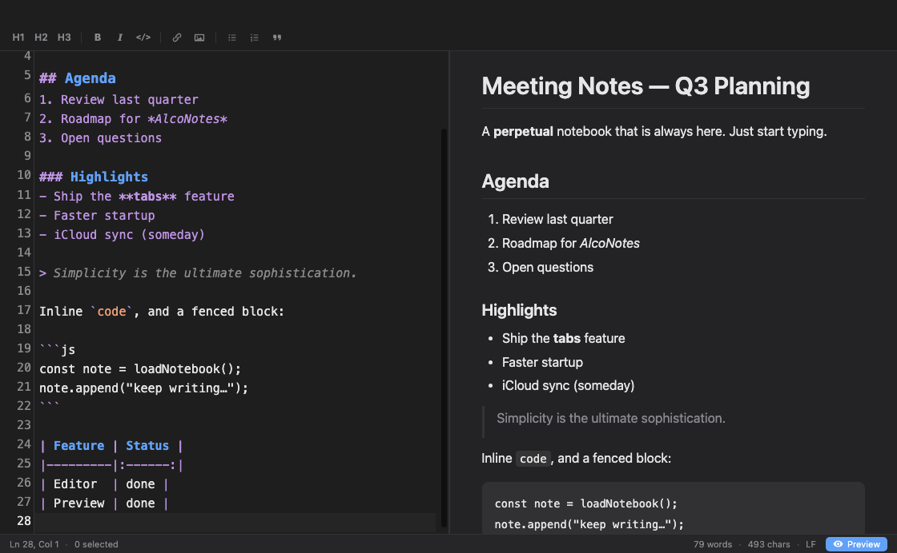

<div align="center">



# AlcoNotes

### The Markdown notebook that's *always already open.*

A fast, native-feeling macOS Markdown editor in the spirit of
[**CotEditor**](https://coteditor.com) — but built around one idea:
**open the app and your note is right there.** No "New Document", no
"Save As", no lost thoughts. Just keep writing.

<br/>


<br/>

<picture>
  <source media="(prefers-color-scheme: dark)" srcset="docs/screenshot-dark.png" />
  <source media="(prefers-color-scheme: light)" srcset="docs/screenshot-light.png" />
  
</picture>

</div>

---

## ✨ Why AlcoNotes

Most editors treat a blank document as a *chore* you have to name and save.
AlcoNotes treats your notebook as a **place you return to** — a single, perpetual
scratch note that's saved for you on every keystroke and picks up exactly where you
left off.

> 💡 Think of it as the sticky note you never lose — with real Markdown superpowers.

## 🚀 Features

| | |
|---|---|
| 📓 **Perpetual notebook** | Launches straight into your always-there note. Auto-saved continuously — never marked "unsaved", never nags you on quit. |
| 🗂 **Tabs** | Mix perpetual notebook tabs with real files from disk in one window — the whole layout is restored on relaunch. |
| ✍️ **Real Markdown editor** | CodeMirror 6 with live syntax highlighting, line numbers, active-line highlight, bracket matching & soft wrap. |
| 👀 **Optional live preview** | A one-click toggle (or `⌘⇧P`) for a rendered side-by-side preview. Off by default — it's there when you want it. |
| 🌗 **Native & theme-aware** | Hidden-inset title bar, system fonts, and light/dark that follows macOS — or force it in **View → Appearance** (remembered across launches). |
| 💾 **Save only if you want** | `⌘S` on a notebook tab saves it to disk — the tab simply becomes that file. `⌘O` opens existing files in tabs. |
| 🔎 **Find & Replace** | `⌘F` / `⌘⌥F` powered by CodeMirror's search. |
| 🔠 **Toolbar & shortcuts** | Bold, italic, code, links, images, headings, lists & blockquotes — one click on the toolbar or one keystroke away. |
| 📊 **Live status bar** | Line/column, selection length, word count & character count. |

## 📥 Get it

Grab a build from [**Releases**](https://github.com/ricardoalcocer/alconotes/releases),
or build it yourself below.

> ℹ️ Builds are unsigned (not notarized), so macOS quarantines **downloaded** copies —
> on recent macOS they may even report as "damaged". Clear the flag with:
>
> ```bash
> xattr -dr com.apple.quarantine /Applications/AlcoNotes.app
> ```
>
> Builds you compile yourself (`npm run dist`) are never quarantined.

## 🛠️ Develop

```bash
npm install     # first time
npm start       # bundle the renderer + launch
```

Live-rebuild the renderer while hacking:

```bash
npm run watch   # esbuild --watch  (terminal 1)
npx electron .  # (terminal 2)
```

## 📦 Build the app

```bash
npm run dist
```

Outputs to `release/`:

- 🍎 `AlcoNotes.app` — the runnable app (`release/mac-arm64/`)
- 💽 `AlcoNotes-<version>-arm64.dmg` — drag-to-install disk image
- 🗜️ `AlcoNotes-<version>-arm64-mac.zip` — zipped app

Built for Apple Silicon (arm64). The app icon is generated into
`build/icon.icns` and embedded automatically.

## 📁 Where your notes live

Every notebook tab is a plain Markdown file:

```
~/Library/Application Support/AlcoNotes/notebooks/*.md
```

(and the tab layout lives next to them in `session.json` — a pre-tabs
`scratch.md` is migrated automatically on first launch). Back them up,
`grep` them, symlink the folder into iCloud/Dropbox — it's just Markdown.
Notebook tabs autosave ~400 ms after you stop typing (and once more on
close), so they survive quits without a save.

## ⌨️ Keyboard shortcuts

| Action | Shortcut | | Action | Shortcut |
|---|---|---|---|---|
| New Tab | `⌘T` | | Toggle Preview | `⌘⇧P` |
| Open | `⌘O` | | Editor only | `⌘⇧E` |
| Save (export) | `⌘S` | | Preview only | `⌘⇧R` |
| Save As | `⌘⇧S` | | Bold / Italic | `⌘B` / `⌘I` |
| Find | `⌘F` | | Inline Code / Link | `⌘K` / `⌘⇧K` |
| Replace | `⌘⌥F` | | Heading 1–3 | `⌘1` · `⌘2` · `⌘3` |
| Bulleted list | `⌘⇧8` | | Numbered list | `⌘⇧7` |
| Blockquote | `⌘⇧.` | | Image | `⌘⇧I` |
| Table | `⌘⇧T` | | Close Tab | `⌘W` |

## 🧱 How it's built

| File | Role |
|------|------|
| `main.js` | Electron main — windows, native menu, file I/O & notebook persistence |
| `preload.js` | `contextBridge` API exposed to the renderer |
| `src/renderer.js` | CodeMirror editor, live preview, status bar, formatting, autosave |
| `build.js` | esbuild config that bundles the renderer into `dist/` |
| `index.html` · `styles.css` | App shell + theming |

**Stack:** Electron · CodeMirror 6 · markdown-it · esbuild · electron-builder

## 🗺️ Roadmap

- [x] Perpetual auto-saved notebook
- [x] Live preview toggle
- [x] Packaged `.app` / `.dmg` with a custom icon
- [x] **Tabs** — notebook tabs and file tabs, restored on relaunch
- [ ] Optional custom notebook location (iCloud/Dropbox sync)
- [ ] Export to HTML / PDF

## 📄 License

[MIT](LICENSE) © [Ricardo Alcocer](https://github.com/ricardoalcocer)

<div align="center"><sub>Built with ☕ and Markdown.</sub></div>
